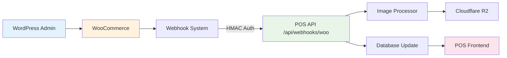

# 🔗 Configuración Webhooks WooCommerce para POS MiniVeci

## 📋 Resumen

Esta guía te ayudará a configurar **webhooks WooCommerce** para sincronización en tiempo real con el POS MiniVeci, logrando una reducción del **90% en requests** (de 288 a 30 requests/día) y **latencia <2 segundos**.

### 🎯 Beneficios de Webhooks
- ⚡ **Tiempo real**: Cambios instantáneos en POS
- 🔄 **90% menos requests** a WordPress
- 🛡️ **Seguridad HMAC** SHA256
- 📱 **Zero configuración** en POS
- 🚀 **Escalable** para miles de productos

## 🏗️ Arquitectura de Sincronización



## 🚀 Paso 1: Preparar WordPress

### 1.1 Verificar Requisitos
```bash
# WordPress Requirements
WordPress: 5.0+
WooCommerce: 4.0+
PHP: 7.4+
SSL: Required (HTTPS)

# Verificar en wp-admin
Tools → Site Health → Info → Server
```

### 1.2 Instalar Plugin (Opcional)
```bash
# Si webhooks no funcionan nativamente
Plugin: "WP Webhooks - Automate & Integrate WordPress"
URL: https://wordpress.org/plugins/wp-webhooks/
```

### 1.3 Configurar SSL
```apache
# .htaccess - Force HTTPS
RewriteEngine On
RewriteCond %{HTTPS} off
RewriteRule ^(.*)$ https://%{HTTP_HOST}%{REQUEST_URI} [L,R=301]
```

## 🔑 Paso 2: Generar Webhook Secret

### 2.1 Crear Secret Fuerte
```bash
# Generar random secret (Linux/Mac)
openssl rand -base64 32

# O usar herramienta online
https://generate-random.org/api-key-generator?count=1&length=32

# Ejemplo resultado
webhook_secret_abc123xyz789def456ghi
```

### 2.2 Guardar en Variables de Entorno
```bash
# .env.local en POS
WOO_WEBHOOK_SECRET=webhook_secret_abc123xyz789def456ghi
```

## 🛠️ Paso 3: Configurar Webhooks en WooCommerce

### 3.1 Acceder a Webhooks
```
WordPress Admin → WooCommerce → Settings → Advanced → Webhooks
```

### 3.2 Crear Webhook: Product Created
```bash
Name: POS MiniVeci - Product Created
Status: Active
Topic: Product created
Delivery URL: https://pos.miniveci.cl/api/webhooks/woo
Secret: webhook_secret_abc123xyz789def456ghi
API Version: WP REST API Integration v3
```

### 3.3 Crear Webhook: Product Updated
```bash
Name: POS MiniVeci - Product Updated  
Status: Active
Topic: Product updated
Delivery URL: https://pos.miniveci.cl/api/webhooks/woo
Secret: webhook_secret_abc123xyz789def456ghi
API Version: WP REST API Integration v3
```

### 3.4 Crear Webhook: Product Deleted
```bash
Name: POS MiniVeci - Product Deleted
Status: Active
Topic: Product deleted
Delivery URL: https://pos.miniveci.cl/api/webhooks/woo
Secret: webhook_secret_abc123xyz789def456ghi  
API Version: WP REST API Integration v3
```

### 3.5 Configuraciones Avanzadas
```bash
# Para cada webhook
Failure delivery: Re-attempt delivery
Max delivery attempts: 5
Retry interval: 60 seconds
Timeout: 30 seconds
```

## 🔒 Paso 4: Verificar Seguridad HMAC

### 4.1 Entender Validación HMAC
```typescript
// El POS valida cada webhook con HMAC SHA256
const expectedSignature = crypto
  .createHmac('sha256', process.env.WOO_WEBHOOK_SECRET!)
  .update(rawBody)  // Payload completo sin parsear
  .digest('base64');

if (signature !== expectedSignature) {
  return NextResponse.json({ error: 'Invalid signature' }, { status: 401 });
}
```

### 4.2 Test de Validación
```bash
# Test endpoint de webhook
curl -X POST https://pos.miniveci.cl/api/webhooks/woo \
  -H "Content-Type: application/json" \
  -H "X-WC-Webhook-Topic: product.updated" \
  -H "X-WC-Webhook-Signature: invalid_signature" \
  -d '{"test": true}'

# Debe responder: 401 Unauthorized
```

## 🧪 Paso 5: Probar Webhooks

### 5.1 Test Product Update
```bash
# 1. Ir a WooCommerce → Products
# 2. Editar cualquier producto
# 3. Cambiar nombre o precio
# 4. Hacer clic en "Update"
# 5. Verificar logs en POS
```

### 5.2 Verificar Logs POS
```bash
# En producción (Cloudflare Pages)
wrangler tail --format=pretty

# En desarrollo
npm run dev
# Ver consola para:
🔔 Webhook received: product.updated for product 123
🖼️ Processing image for product TEST-SKU...
✅ Product woo-123 updated via webhook
```

### 5.3 Verificar en WordPress
```bash
# WooCommerce → Settings → Advanced → Webhooks
# Hacer clic en webhook creado
# Ir a tab "Logs"

# Debe mostrar:
Status: 200 OK
Response: {"success":true,"message":"Processed product.updated for product 123"}
```

## 🚨 Paso 6: Troubleshooting

### 6.1 Webhook no se Dispara
```bash
# Posibles causas:
1. Plugin de cache bloqueando
2. Firewall/security plugin
3. WooCommerce outdated
4. PHP memory limit

# Soluciones:
1. Excluir /api/webhooks/* del cache
2. Whitelist IP de POS en security
3. Actualizar WooCommerce
4. Aumentar memory_limit en php.ini
```

### 6.2 Error 401 Unauthorized
```bash
# Causa: Secret incorrecto o signature inválida
# Verificar:
echo "WOO_WEBHOOK_SECRET: $WOO_WEBHOOK_SECRET"

# En WordPress, verificar secret exacto en webhook
# No debe tener espacios ni caracteres extra
```

### 6.3 Error 500 Internal Server Error
```bash
# Verificar logs POS
wrangler tail

# Causas comunes:
1. R2 credentials incorrectas
2. Database connection failed
3. Sharp/image processing error

# Verificar variables de entorno:
R2_ACCESS_KEY_ID=xxx
R2_SECRET_ACCESS_KEY=xxx
TURSO_DATABASE_URL=xxx
TURSO_AUTH_TOKEN=xxx
```

### 6.4 Webhooks Lentos (>5s)
```bash
# Optimizar imagen processing:
1. Verificar R2 endpoint region
2. Reducir quality WebP (85 → 75)
3. Implementar async processing

# En image-processor.ts:
const variants = await Promise.all([
  // Procesar 3 variantes en paralelo
]);
```

## 📊 Paso 7: Monitoreo de Webhooks

### 7.1 Dashboard WooCommerce
```bash
# Cada webhook muestra estadísticas:
Total deliveries: 145
Successful: 142 (97.9%)
Failed: 3 (2.1%)
Last delivery: 2 minutes ago
```

### 7.2 Logs en POS
```typescript
// Implementar métricas custom
let webhookStats = {
  total: 0,
  success: 0,
  failed: 0,
  avgProcessingTime: 0,
};

// En /api/webhooks/woo/route.ts
export async function POST(request: Request) {
  const startTime = Date.now();
  webhookStats.total++;
  
  try {
    // ... procesamiento
    webhookStats.success++;
    
    const duration = Date.now() - startTime;
    webhookStats.avgProcessingTime = 
      (webhookStats.avgProcessingTime + duration) / 2;
      
    console.log(`✅ Webhook processed in ${duration}ms`);
  } catch (error) {
    webhookStats.failed++;
    console.error('❌ Webhook failed:', error);
  }
}
```

### 7.3 Alertas Automáticas
```typescript
// Slack/Discord webhook para errores críticos
async function sendAlert(message: string) {
  if (webhookStats.failed > 10) {
    await fetch(process.env.SLACK_WEBHOOK_URL!, {
      method: 'POST',
      headers: { 'Content-Type': 'application/json' },
      body: JSON.stringify({
        text: `🚨 POS Webhook Alert: ${message}`,
        channel: '#dev-alerts'
      })
    });
  }
}
```

## ⚡ Paso 8: Optimizaciones Avanzadas

### 8.1 Batch Processing
```typescript
// Para sitios con muchos cambios simultáneos
const BATCH_DELAY = 2000; // 2 segundos
const pendingUpdates = new Map();

export async function POST(request: Request) {
  const payload = await request.json();
  
  // Agregar a batch
  pendingUpdates.set(payload.id, payload);
  
  // Procesar batch después de delay
  setTimeout(async () => {
    const batch = Array.from(pendingUpdates.values());
    pendingUpdates.clear();
    
    await processBatch(batch);
  }, BATCH_DELAY);
}
```

### 8.2 Retry Logic
```typescript
// Retry automático con exponential backoff
async function processWithRetry(payload: any, maxRetries = 3) {
  for (let attempt = 1; attempt <= maxRetries; attempt++) {
    try {
      await processProductImage(payload);
      break;
    } catch (error) {
      if (attempt === maxRetries) throw error;
      
      const delay = Math.pow(2, attempt) * 1000; // 2s, 4s, 8s
      await new Promise(resolve => setTimeout(resolve, delay));
    }
  }
}
```

### 8.3 Rate Limiting
```typescript
// Proteger contra spam de webhooks
import { Ratelimit } from "@upstash/ratelimit";
import { Redis } from "@upstash/redis";

const ratelimit = new Ratelimit({
  redis: Redis.fromEnv(),
  limiter: Ratelimit.slidingWindow(10, "1 m"), // 10 requests per minute
});

export async function POST(request: Request) {
  const ip = request.headers.get("x-forwarded-for") ?? "127.0.0.1";
  const { success } = await ratelimit.limit(ip);
  
  if (!success) {
    return NextResponse.json(
      { error: "Rate limit exceeded" },
      { status: 429 }
    );
  }
  
  // ... resto del procesamiento
}
```

## 🔧 Paso 9: Configuraciones Específicas por Host

### 9.1 SiteGround
```php
// wp-config.php
define('WP_HTTP_BLOCK_EXTERNAL', false);
define('WP_ACCESSIBLE_HOSTS', 'pos.miniveci.cl');

// Aumentar timeout
ini_set('max_execution_time', 300);
ini_set('memory_limit', '512M');
```

### 9.2 WP Engine
```bash
# Contactar soporte para whitelist:
- pos.miniveci.cl 
- *.cloudflare.com (para R2)

# Configurar en wp-config.php:
define('WPE_GOVERNOR', false); // Disable rate limiting para webhooks
```

### 9.3 Cloudflare (WordPress)
```bash
# Page Rules para /wp-admin/admin-ajax.php
Cache Level: Bypass
Security Level: Medium

# Para webhooks específicos, crear Worker:
addEventListener('fetch', event => {
  if (event.request.url.includes('/admin-ajax.php')) {
    // Bypass todos los cachés y security para webhooks
    return fetch(event.request, {
      cf: { cacheEverything: false }
    });
  }
});
```

## ✅ Paso 10: Testing Completo

### 10.1 Test Matrix
```bash
# Productos
✅ Crear producto nuevo → Webhook product.created
✅ Editar producto existente → Webhook product.updated  
✅ Cambiar imagen → Procesamiento R2
✅ Cambiar solo precio → Skip image processing
✅ Eliminar producto → Webhook product.deleted

# Seguridad
✅ Webhook sin signature → 401 Unauthorized
✅ Webhook signature inválida → 401 Unauthorized
✅ Payload malformado → 400 Bad Request

# Performance  
✅ Webhook <2s response → ✅ OK
✅ Image processing <30s → ✅ OK
✅ Multiple webhooks parallel → ✅ OK
```

### 10.2 Load Testing
```bash
# Simular múltiples updates
for i in {1..10}; do
  curl -X POST "https://miniveci.cl/wp-admin/admin-ajax.php" \
    -d "action=update_product&id=$i" &
done
wait

# Verificar que todos lleguen al POS
```

### 10.3 Checklist Final
- [ ] ✅ 3 webhooks creados (created, updated, deleted)
- [ ] ✅ Secret configurado y matching
- [ ] ✅ HTTPS funcionando en ambos lados
- [ ] ✅ Test product update → POS actualizado <2s
- [ ] ✅ Image change → R2 processing funcionando
- [ ] ✅ Logs sin errores en ambos lados
- [ ] ✅ Rate limiting configurado
- [ ] ✅ Monitoring y alertas activas

## 🎉 ¡Configuración Completa!

Ahora tienes sincronización **tiempo real** entre WooCommerce y POS con:

- ⚡ **<2 segundos** de latencia
- 🔒 **Seguridad HMAC** validada
- 📈 **90% menos** requests a WordPress  
- 🖼️ **Procesamiento automático** de imágenes
- 🛡️ **Error handling** robusto
- 📊 **Monitoreo** completo

## 🚀 Siguientes Pasos

1. **[Setup Cloudflare R2](./CLOUDFLARE_R2_SETUP.md)** (si no lo has hecho)
2. **[Deploy POS en producción](./DEPLOYMENT.md)**
3. **[Configurar monitoreo avanzado](./MONITORING.md)**
4. **[Entrenar equipo](./TRAINING.md)** en uso del POS

---

## 🆘 Support

**¿Problemas con webhooks?**
1. Verificar logs en WordPress → WooCommerce → Webhooks  
2. Verificar logs en POS → `wrangler tail`
3. Abrir issue en GitHub con logs completos
4. Contactar en Discord `#dev-support`

**Webhooks complejos:**
- Múltiples sitios WooCommerce
- B2B con pricing personalizado  
- Inventory management avanzado
- Integration con ERPs externos

*Contacta al equipo para configuraciones enterprise*

---

*¡Ya tienes sincronización tiempo real! 🚀*